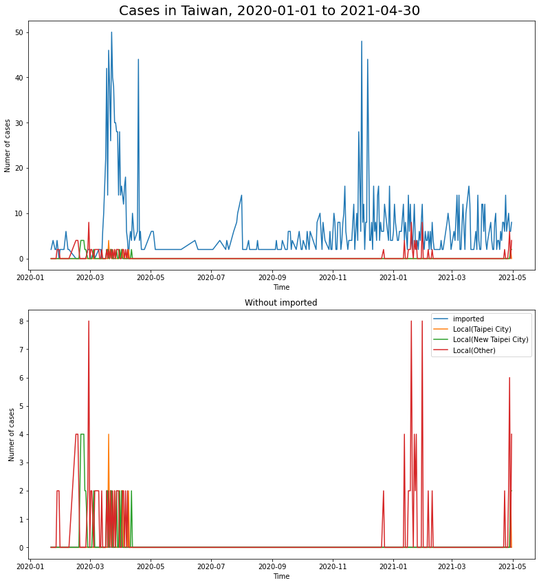
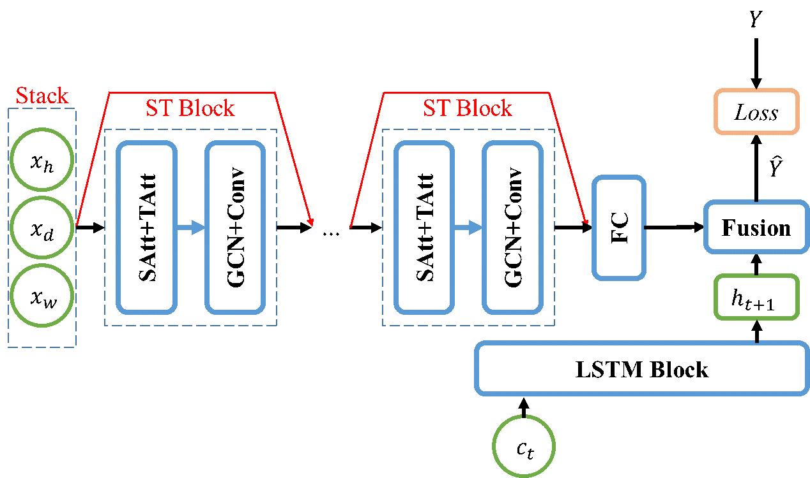
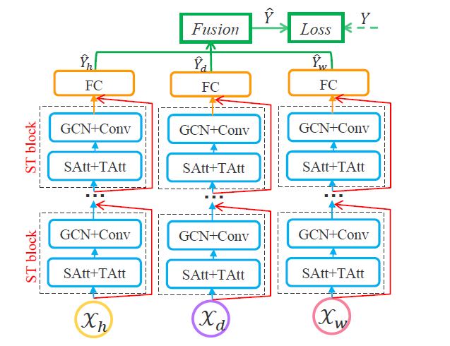

# Traffic Flow Prediction(TFP) on Taipei metro with daily COVID-19 cases

## **資料來源** 
- 台灣每日確診人數資訊: 衛福部疾管署(CDC)
- 臺北捷運每小時各站進出人流: 政府開放資料平台

## **參考文獻** 
- **DCRNN**: Diffusion Convolutional Recurrent Neural Network: data-driven traffic forecasting, 2018
- **ST-GCN**: Predicting Station-Level Short-Term Passenger Flow in a Citywide Metro Network Using Spatiotemporal Graph Convolutional Neural Networks, 2019
- **ASTGCN**: Attention Based Spatial-Temporal Graph Convolutional Networks for Traffic Flow Forecasting, 2019 

## **介紹** 
隨著嚴重特殊傳染性肺炎（Coronavirus disease 2019，縮寫：COVID-19）的疫情延燒，在大眾運輸上除了定期消毒、強制佩戴口罩以及勸導大眾盡可能的保持社交距離外，在確診個案搭乘過的軌跡上也派遣化學兵進行徹底消毒。為避免暴露於確診的風險當中，許多公司啟動分組工作或在家工作的模式，以避免員工感染；各級學校也以停課不停學，讓各位學生遠距上課，綜合許多因素使得捷運搭乘流量減少，流量的趨勢相比以往也更為不同。

 
臺北捷運路線圖(source: 臺北大眾捷運股份有限公司)

本篇基於社群網路的性質，將捷運路網視為一具有方向性、時間性的圖（Graph），每個捷運站便是圖中的節點（Node），兩站之間是否相連可到達便是邊（Edge），嘗試將深度學習、社群網路的方法應用至台北捷運的交通流量預測，並試圖在固有方法上納入每日的確診人數資訊使預測任務更加準確。 

 
台灣每日新增確診人數(2020-01-01 to 2021-04-30)

## **模型** 
基於社群網路在交通流量預測的方法，本篇根據ASTGCN的方法再根據當前資料的特性做出調整。在輸入上分別代表前h小時進出流量、前d日在特定時段的進出流量及前w個禮拜在特定時段的進出流量。 

整體流程上的特色在於將捷運流量分別對空間與時間進行了注意力機制（Attention），SAtt（Spatial Attention）與TAtt（Temporal Attention）分別為針對空間、時間的注意力機制；GCN代表圖卷積（Graph Convolution）；Conv代表卷積（Convolution）；FC代表全連接層（Fully-connected）；ST block代表 Spatial-Temporal block，以塊（block）的方式表示該結構以相似的方式進行串接；最後LSTM block代表LSTM模型，主要將每日COVID-19確診人數的資訊進行特徵提取。

 
本篇研究之模型架構

 
ASTGCN(source: ASTGCN, Guo etal., 2019)

## **實驗結果** 
實驗當中，資料依據捷運資料的時間長度切前90%作為訓練資料，後10%以5%、5%分作驗證資料與測試資料，迭代數皆為150個epochs。下表為本次實驗的結果，在這次的預測任務上主要呈現MAE、RMSE及MAPE三種指標，在模型編號1與編號2的差別在於是否有利用LSTM納入COVID-19資料，而該結果主要顯示了考慮COVID-19資料能使預測任務更加準確，特別在MAE與MAPE皆比原本少。 
而模型編號3，主要是以其他的形式考慮COVID-19資料，每個站點都會考慮該站的行政區(ex.台北車站/中正區、圓山/中山區大同區交界)，的前7天確診人數，若為兩行政區交界點則取平均作為代表。而這樣的模型訓練效果並不佳，猜測原因主要有兩種：(1) 在2021年5月前，台灣的本土確診數極低，有多數的天數確診數為個位數，若在畫分到以行政區區分則會使得大多數的資料為0，因此模型不但學不到特徵、多使用了額外的參數，更混亂了其他特徵之間的聚合；(2) 捷運資料與COVID-19資料為兩種不同時間步長的資料，一種為小時一種為天，因此把COVID-19資料根據時間串接給捷運資料時會使當天的捷運進出站人數串接到同樣的COVID-19特徵，這也使模型沒辦法好好進行聚合。

|  Model No.  |  (hourly, Daily, Weekly)  |  With COVID-19 features  |     MAE    |  Metrics RMSE  |     MAPE    |
|  :----:  | :----:  |  :----:  |  :----:  |  :----:  |  :----:  |
|  1  | (2,2,1)  |  No  |  95.09  |  177.98  |  100.71  |
|  2  | (2,2,1)  |  Yes  |  **78.47**  |  **164.71**  |  **76.88**  |
|  3  | (2,2,1)  |  x  |  870.64  |  1392.36  |  2313.79  |

Maily use `Train_ASTGCN_LSTM.py`  
Otherwise:  
- Data reformat and visualization: `data preprocess.ipynb`
- Get matro location: `preprocess/GetMetroDistrict.py`
- Test of model function: `train_ASTGCN_LSTM.ipynb`